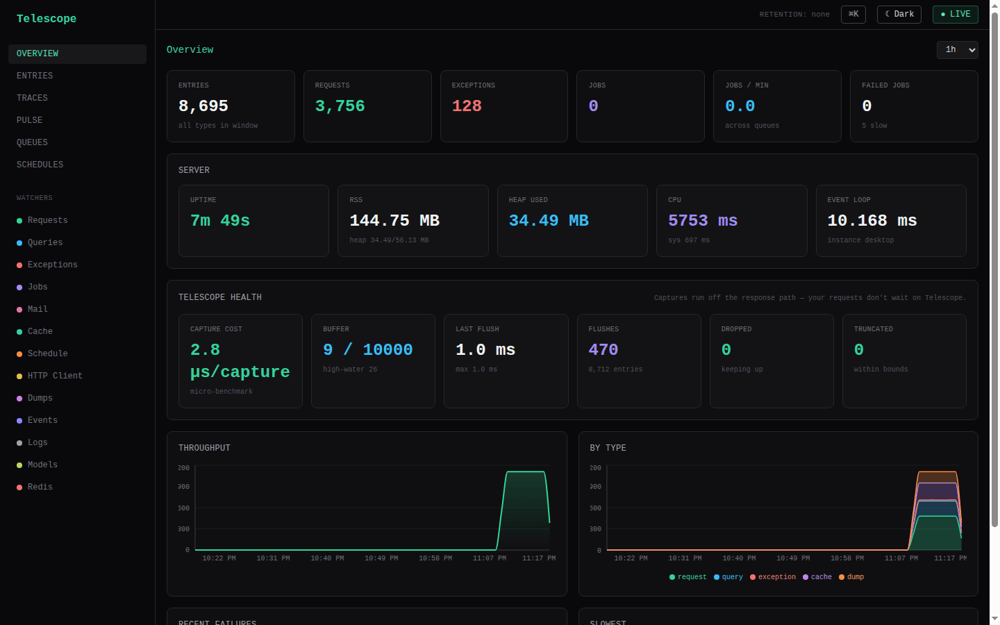
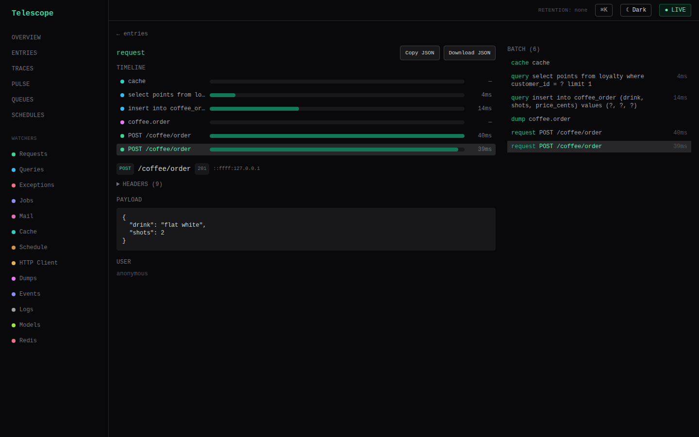

# nestjs-telescope

[](https://www.npmjs.com/package/@dudousxd/nestjs-telescope)
[](https://github.com/DavideCarvalho/nestjs-telescope/actions/workflows/ci.yml)
[](./LICENSE)

> Laravel Telescope, redesigned for NestJS. Watch every request, query, job,
> email, cache hit, and exception — correlated under one batch, off the response
> path, pluggable, and safe in production. Alert new errors to Slack, diagnose
> them with AI, capture frontend errors, and archive before you prune. Express
> **and** Fastify.

`@dudousxd/nestjs-telescope` is an application observability console for NestJS.
A set of watchers capture what happens *inside* a request — every query, queued
job, sent email, cache hit, and thrown exception — correlate it all under one
**batch** via `AsyncLocalStorage`, store it through a pluggable provider, and
expose it through a headless API plus an optional dashboard. It's the missing
Telescope for NestJS, designed framework-idiomatically rather than ported.



## Quick start

**1. Install** core and the dashboard:

```bash
pnpm add @dudousxd/nestjs-telescope @dudousxd/nestjs-telescope-ui
```

**2. Import** two modules. Request and exception capture wire themselves
automatically, and a zero-config SQLite store is on by default:

```ts
import { Module } from '@nestjs/common';
import { TelescopeModule } from '@dudousxd/nestjs-telescope';
import { TelescopeUiModule } from '@dudousxd/nestjs-telescope-ui';

@Module({
  imports: [
    TelescopeModule.forRoot({
      // dev: rich capture, open gate. prod: flip enabled + supply an authorizer.
      enabled: process.env.NODE_ENV !== 'production',
      authorizer: () => true, // gates the API; defaults to deny in production
      prune: { after: '24h' },
    }),
    TelescopeUiModule.forRoot(),
  ],
})
export class AppModule {}
```

Boot, then open **`/telescope`** for the dashboard or hit
`GET /telescope/api/entries/:id` for a request and everything it caused. Most
apps are done in under five minutes — see the
[Getting Started guide](https://davidecarvalho.github.io/nestjs-telescope/docs/getting-started).

## What you get

| Feature | What it does |
|---------|--------------|
| **Watchers** | Request, query, job, mail, cache, schedule, HTTP-client, and exception capture — correlated under one batch in capture order. |
| **Queue console** | A Horizon-style live view of BullMQ and SQS queues: per-state depth, individual jobs, and (behind a second default-deny gate) retry / remove / promote / redrive. |
| **Pulse** | At-a-glance health: per-type counts, slowest entries, top exceptions, N+1 hotspots, and a throughput sparkline — rolled up from captured entries. |
| **Health & overhead** | Capture runs *off* the response path; the dashboard surfaces Telescope's own host-path µs/capture, buffer pressure, and flush p95 on a `/health` card. |
| **Storage adapters** | A pluggable `StorageProvider` SPI with a self-healing schema: SQLite by default, swap in Redis (multi-instance) or your own. Per-type retention + an `archive.sink` to ship doomed entries to S3 before prune. |
| **Error alerting** | A genuinely *new* exception family pages you — Slack (Block Kit, route/user, deep link), a raw webhook, or a custom sink — plus rate, slow-route, and dropped-entry rules. |
| **AI diagnosis** | `@dudousxd/nestjs-telescope-ai` turns an exception into a probable-cause / suggested-fix report (Bedrock, OpenAI, any AI-SDK model). On-demand button or auto-mode that enriches the Slack alert. |
| **Frontend errors** | An opt-in public endpoint records browser `client_exception` reports through the same pipeline — family hashing, alerts, archive, dashboard. |
| **Request replay** | Re-issue a captured request against the local app from the dashboard (gated by `authorizeAction`, like a queue mutation); replayed calls carry an `x-telescope-replay: 1` header and a `replay` tag. |
| **MCP server** | A stateless JSON-RPC MCP endpoint lets coding agents (Claude Code, Cursor, …) query the captured data directly — list entries, pull a batch waterfall, read the health snapshot, diagnose an exception. |
| **Overload protection** | Watches event-loop lag and auto-pauses capture under pressure, resuming when the loop recovers — a telescope under load can never amplify an incident (on by default). |
| **Dashboard auth** | A read `authorizer` gates the API (default-deny in production); a separate `authorizeAction` fails closed for every mutation. |

## Dashboard

```ts
import { TelescopeUiModule } from '@dudousxd/nestjs-telescope-ui';
// imports: [TelescopeModule.forRoot(), TelescopeUiModule.forRoot()]
```

A bundled React SPA served by a NestJS module — no frontend dependency imposed
on your app. Open any request to see its **correlated batch**: a waterfall of
the cache reads, queries, jobs, and exceptions it caused, alongside the request
itself.



## MCP server

Let a coding agent debug straight from the captured data. With `mcp` enabled,
Telescope serves a stateless JSON-RPC [Model Context Protocol](https://modelcontextprotocol.io)
server (streamable-HTTP) at `<path>/api/mcp`, so an agent can answer
*"why is `POST /checkout` slow?"* by pulling the batch waterfall with every query
it ran — backed by the same storage/stats/diagnosis APIs as the dashboard.

```ts
TelescopeModule.forRoot({
  // dev-only default: open when NODE_ENV !== 'production', refused in prod
  mcp: true,
  // or require a Bearer token (the only way to expose it in production):
  // mcp: { token: process.env.TELESCOPE_MCP_TOKEN },
  // mcp: false  // (or omitting it) disables the endpoint entirely
});
```

Register it with Claude Code:

```bash
claude mcp add --transport http telescope http://localhost:3000/telescope/api/mcp
```

Tools exposed: `list_entries` (filter by type/search/tag/time window),
`get_entry` (one entry + its full batch), `get_batch`, `get_stats` (the last-hour
health snapshot), and `diagnose_exception` (AI diagnosis, when `ai` is
configured). When a `token` is set every request must carry
`Authorization: Bearer <token>`; without one the endpoint is allowed only when
`NODE_ENV !== 'production'`.

## Links

- **Documentation** — https://davidecarvalho.github.io/nestjs-telescope
- **Example app** — [`examples/basic-app`](./examples/basic-app) boots with zero
  config and fills its own dashboard while you watch.
- **Recipes** — [custom storage](https://davidecarvalho.github.io/nestjs-telescope/docs/recipes/custom-storage),
  [custom watcher](https://davidecarvalho.github.io/nestjs-telescope/docs/recipes/custom-watcher),
  [dashboard auth](https://davidecarvalho.github.io/nestjs-telescope/docs/recipes/dashboard-auth),
  [tags & redaction](https://davidecarvalho.github.io/nestjs-telescope/docs/recipes/tags-and-redaction),
  [archiving to S3](https://davidecarvalho.github.io/nestjs-telescope/docs/recipes/archiving-exceptions-to-s3),
  [reporting frontend errors](https://davidecarvalho.github.io/nestjs-telescope/docs/recipes/reporting-frontend-errors),
  [AI exception diagnosis](https://davidecarvalho.github.io/nestjs-telescope/docs/recipes/ai-exception-diagnosis).
- **Architecture** — [`DESIGN.md`](./DESIGN.md) · **Product brief** — [`PRODUCT.md`](./PRODUCT.md)

## Packages

| Package | What it is |
|---------|------------|
| `@dudousxd/nestjs-telescope` | Core: request + exception watchers, recorder, ALS correlation, SQLite store, headless API, guard, pruner |
| `@dudousxd/nestjs-telescope-ui` | Bundled dashboard SPA + composable React components / hooks / client |
| `@dudousxd/nestjs-telescope-mikro-orm` | MikroORM query watcher + N+1 detector |
| `@dudousxd/nestjs-telescope-typeorm` | TypeORM query watcher (host-wired logger) |
| `@dudousxd/nestjs-telescope-prisma` | Prisma query watcher (`$on('query')`) |
| `@dudousxd/nestjs-telescope-bullmq` | BullMQ job watcher: per-job capture + correlation |
| `@dudousxd/nestjs-telescope-mail` | Mail watcher (nodemailer `sendMail`) |
| `@dudousxd/nestjs-telescope-cache` | Cache watcher (get/set hit/miss) |
| `@dudousxd/nestjs-telescope-schedule` | Schedule watcher (`@nestjs/schedule` cron/interval) |
| `@dudousxd/nestjs-telescope-redis` | Redis-backed shared storage (multi-instance) |
| `@dudousxd/nestjs-telescope-ai` | AI exception diagnoser (Vercel AI SDK — Bedrock, OpenAI, any model) |
| `@dudousxd/nestjs-telescope-otel` | OpenTelemetry trace-context provider + bridge |
| `@dudousxd/nestjs-telescope-testing` | In-memory store, `FakeClock`, watcher test harness |

## License

MIT © Davi Carvalho
